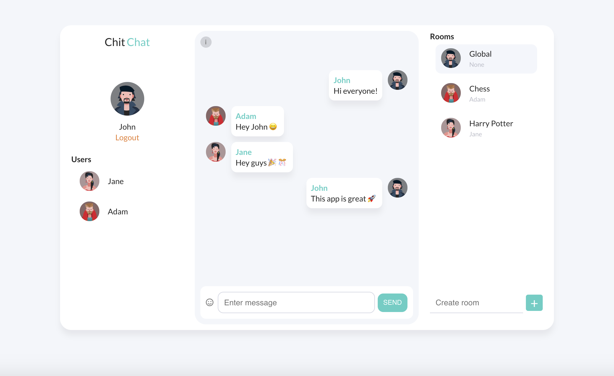

## ChatConnect

ChatConnect is an innovative multiroom chat application that leverages the power of socket.io, Node.js, and React.js to offer users a seamless and real-time chatting experience.
With its intuitive emoji selector, users can express themselves effortlessly. The app ensures persistent connections with session storage, allowing users to pick up conversations 
seamlessly. Additionally, it keeps users informed with handy alerts, notifying them when others enter or leave a room. ChatConnect is the ideal platform for connecting with others, 
engaging in vibrant discussions, and fostering meaningful conversations.

    

## Features

- Realtime chat with socket.io :rocket:
- Multiroom chat :speech_balloon:
- Emoji selector :heart_eyes:
- Persistent connection with session storage :signal_strength:
- User alerts eg. user entered chat, user left room :rotating_light:

